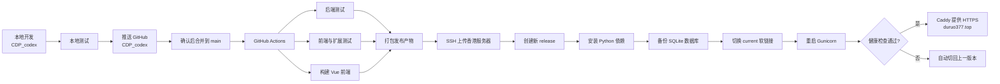

# CDP 项目上线与自动部署说明

> 一句话概括：本地在 `CDP_codex` 分支开发和验证，确认后合并到 `main`；`main` 一旦推送到 GitHub，GitHub Actions 会自动测试、构建并上传版本包到香港服务器，服务器切换版本并完成健康检查，最后由 Caddy 通过 `https://duruo377.top` 对外提供服务。

## 1. 部署链路一览



生产环境不会在服务器上执行 `git pull`。GitHub Actions 构建出可运行的发布包，通过 SSH/SCP 上传到服务器，再由发布脚本激活。

## 2. 当前生产环境

| 项目 | 当前配置 |
|---|---|
| GitHub 仓库 | `aidenLi377/cdp-engine` |
| 开发分支 | `CDP_codex`，日常开发和验证使用 |
| 生产分支 | `main`，推送后自动部署 |
| 域名 | `duruo377.top` |
| 服务器 | 腾讯云轻量应用服务器，中国香港 |
| 公网 IP | `43.129.69.144` |
| 系统 | Debian 13 |
| 规格 | 2 核 CPU、2 GB 内存、40 GB 系统盘、2 GB Swap |
| 部署用户 | `cdpdeploy` |
| Web 入口 | Caddy，监听 80/443 并自动管理 HTTPS 证书 |
| 后端 | Flask + Gunicorn，监听服务器本机 `127.0.0.1:5000` |
| 前端 | Vue/Vite 构建后的静态文件 |
| 数据库 | SQLite：`/srv/cdp/shared/cdp.db` |

## 3. 日常开发与上线

### 3.1 在开发分支工作

```bash
git switch CDP_codex

# 修改代码并完成本地验证
git status
git add <本次需要提交的文件>
git commit -m "说明本次改动"
git push origin CDP_codex
```

`CDP_codex` 推送到 GitHub不会触发生产部署，适合继续检查代码或发起 Pull Request。

### 3.2 发布到生产环境

确认开发分支可用后，将它合并到 `main`：

```bash
git switch main
git pull --ff-only origin main
git merge CDP_codex
git push origin main
```

`git push origin main` 是自动上线的触发点。推送成功不等于部署完成，还应到 GitHub 仓库的 **Actions** 页面确认 `Test, build, and deploy production` 工作流变为绿色。

推荐长期使用 Pull Request 将 `CDP_codex` 合并到 `main`，这样生产改动更容易审查和追踪。

### 3.3 上线后验证

至少检查以下地址和功能：

1. 打开 `https://duruo377.top`，确认页面和登录正常。
2. 打开 `https://duruo377.top/api/health`，应返回 `status: ok`。
3. 检查公共方案库、方案保存和任务中台等关键功能。
4. 如果本次修改了浏览器扩展，重新加载扩展后再验证自动圈人。

## 4. GitHub Actions 做了什么

工作流文件：[`.github/workflows/deploy.yml`](.github/workflows/deploy.yml)。

它只在以下情况运行：

- 推送到 `main`；
- 在 GitHub Actions 页面手动执行 `workflow_dispatch`。

每次运行依次执行：

1. 拉取当前 `main` 的源代码。
2. 使用 Python 3.13 安装后端依赖。
3. 运行 Python 后端测试。
4. 使用 Node.js 24 安装前端依赖。
5. 运行前端测试。
6. 运行 `DMP_PluginV2.1-CDP-Merged` 浏览器扩展测试。
7. 执行 `npm run build`，生成 `cdp-web/dist`。
8. 仅打包生产运行需要的后端代码、CSV/模板和前端 `dist`。
9. 用 SSH 将压缩包上传到 `/srv/cdp/incoming/<Git提交SHA>.tar.gz`。
10. 上传并执行 [`deploy/deploy-release.sh`](deploy/deploy-release.sh)。

下列本地内容不会进入生产发布包：

- `.runtime/` 和本地 SQLite 数据库；
- `.env`、私钥和本地配置；
- `node_modules/`、Python 虚拟环境和缓存；
- 前端源代码的开发依赖；
- 浏览器扩展本体。工作流只测试扩展，不会把它安装到用户浏览器。

## 5. 服务器内部结构

```text
/srv/cdp/
├── current -> /srv/cdp/releases/<Git提交SHA>  # 当前运行版本的软链接
├── releases/                                  # 每次发布的独立版本
├── incoming/                                  # Actions 上传的临时压缩包
├── shared/
│   └── cdp.db                                 # 跨版本持久化数据库
├── backups/                                   # 每次发布前的数据库备份
└── deploy-release.sh                          # Actions 上传的发布脚本

/etc/cdp/cdp.env                               # 生产环境变量，不进入 Git
/etc/systemd/system/cdp.service                # 后端 systemd 服务
/etc/caddy/Caddyfile                           # 域名、HTTPS、静态文件和 API 反代
/var/log/cdp/                                  # 应用日志目录
```

每个版本拥有独立的 `.venv`。数据库、环境变量和日志位于版本目录之外，因此新版本上线不会覆盖生产数据或密钥。

## 6. 服务器上的运行方式

### Caddy

配置文件：[`deploy/Caddyfile`](deploy/Caddyfile)。

- `https://duruo377.top/api/*` 反向代理到 Gunicorn：`127.0.0.1:5000`；
- 其他请求读取 `/srv/cdp/current/cdp-web/dist`；
- Vue 前端路由找不到实体文件时回退到 `index.html`；
- `www.duruo377.top` 永久跳转到主域名；
- Caddy 自动申请和续期 HTTPS 证书。

### systemd + Gunicorn

服务定义：[`deploy/cdp.service`](deploy/cdp.service)。

- 服务名：`cdp.service`；
- 运行用户：`cdpdeploy`；
- 工作目录：`/srv/cdp/current`；
- 环境变量：`/etc/cdp/cdp.env`；
- Gunicorn：2 个同步 worker，绑定 `127.0.0.1:5000`；
- 进程异常退出后由 systemd 自动重启。

## 7. 自动回滚与数据保护

发布脚本会执行以下保护：

1. 用文件锁阻止两个部署同时修改生产环境。
2. 检查发布包是否包含后端入口、依赖文件和前端构建结果。
3. 在最终版本路径创建 Python 虚拟环境并验证应用可以导入。
4. 切换版本前，将现有数据库备份到 `/srv/cdp/backups/`。
5. 使用软链接原子切换 `/srv/cdp/current`。
6. 重启服务后，最多检查 30 次 `/api/health`。
7. 服务启动失败或健康检查失败时，自动将 `current` 切回上一版本并重启。

代码回滚不会自动回滚数据库。若确实需要恢复数据库，应先停止服务、额外备份当前数据库，再由维护人员选择 `/srv/cdp/backups/` 中的正确文件恢复。

## 8. GitHub Secrets

GitHub 仓库的 **Settings → Secrets and variables → Actions** 中配置以下 Repository Secrets：

| Secret | 用途 |
|---|---|
| `DEPLOY_HOST` | 服务器地址，当前为 `43.129.69.144` |
| `DEPLOY_USER` | SSH 部署用户，当前为 `cdpdeploy` |
| `DEPLOY_SSH_KEY` | GitHub Actions 使用的 SSH 私钥全文 |
| `DEPLOY_KNOWN_HOSTS` | 固定服务器 SSH 主机指纹，防止连接到伪造服务器 |

私钥、生产环境变量、管理员密码不得写进代码、提交记录或本文档。

## 9. 服务器一次性初始化

这部分在当前服务器上已经完成，仅在重装或更换服务器时使用。

1. 安装 Python、`python3-venv`、构建工具、SQLite、Caddy 等系统依赖。
2. 创建无密码登录的部署用户 `cdpdeploy`。
3. 将 GitHub Actions 公钥写入 `/home/cdpdeploy/.ssh/authorized_keys`。
4. 创建 `/srv/cdp`、`/var/log/cdp` 等目录并设置权限。
5. 执行 [`deploy/bootstrap-server.sh`](deploy/bootstrap-server.sh)：
   - 生成 `/etc/cdp/cdp.env`；
   - 安装 `cdp.service`；
   - 安装 Caddy 配置；
   - 仅授予 `cdpdeploy` 重启/停止/查询 `cdp.service` 的 sudo 权限；
   - 启用 systemd 服务并校验 Caddy 配置。
6. 在腾讯云防火墙中放行 TCP 22、80、443。
7. 将域名 A 记录解析到服务器公网 IP。
8. 在 GitHub 中配置四个部署 Secrets，并首次运行工作流。

## 10. 浏览器扩展是独立发布链路

扩展目录：[`DMP_PluginV2.1-CDP-Merged`](DMP_PluginV2.1-CDP-Merged)。

服务器上线不会自动把扩展安装到用户电脑。使用任务中台自动圈人时，每位用户都需要：

1. 在 Chrome 打开 `chrome://extensions`。
2. 开启开发者模式。
3. 选择“加载已解压的扩展程序”。
4. 选择 `DMP_PluginV2.1-CDP-Merged` 目录。
5. 扩展更新后点击“重新加载”，并刷新 `duruo377.top`。

线上域名需要同时存在于以下三处：

- `manifest.json` 的 `host_permissions`；
- `manifest.json` 中加载 `bridge.js` 的 `content_scripts.matches`；
- `background.js` 的 `ALLOWED_ORIGINS`。

## 11. 常用排查命令

在服务器上执行：

```bash
# 后端服务状态
systemctl status cdp --no-pager

# 最近 100 行后端日志
journalctl -u cdp -n 100 --no-pager

# 本机后端健康检查
curl -fsS http://127.0.0.1:5000/api/health

# 外部 HTTPS 健康检查
curl -fsS https://duruo377.top/api/health

# 查看当前版本
readlink -f /srv/cdp/current

# 查看已有版本和数据库备份
ls -lah /srv/cdp/releases
ls -lah /srv/cdp/backups

# 校验 Caddy 配置
caddy validate --config /etc/caddy/Caddyfile
```

常见问题判断：

| 现象 | 优先检查 |
|---|---|
| GitHub Actions 红色 | Actions 中具体失败步骤、四个 Secrets 是否完整 |
| 网站 502 | `systemctl status cdp` 和 `journalctl -u cdp` |
| 首页能开、API 失败 | Gunicorn、`/api/health`、Caddy 反代 |
| HTTPS 证书失败 | DNS 是否指向服务器、80/443 是否放行、Caddy 日志 |
| 发布后数据为空 | 是否误用了版本目录内数据库；生产库应为 `/srv/cdp/shared/cdp.db` |
| 任务中台显示扩展未连接 | Chrome 是否加载/重载扩展，线上域名是否存在于扩展三处白名单 |
| 自动圈人提示来源不允许 | `background.js` 的 `ALLOWED_ORIGINS` 和扩展是否重新加载 |

## 12. 发布检查清单

发布前：

- [ ] 本地改动只包含本次需要上线的内容。
- [ ] `.env`、数据库、私钥、日志和缓存没有进入 Git。
- [ ] 后端、前端和扩展相关测试通过。
- [ ] `CDP_codex` 已推送并完成检查。
- [ ] 确认本次改动适合合并到生产分支。

发布后：

- [ ] GitHub Actions 工作流为绿色。
- [ ] `https://duruo377.top/api/health` 返回正常。
- [ ] 首页、登录、公共方案库和关键业务功能正常。
- [ ] 服务器 `current` 指向本次 Git 提交 SHA。
- [ ] 若修改扩展，Chrome 已重新加载扩展并验证任务中台。

